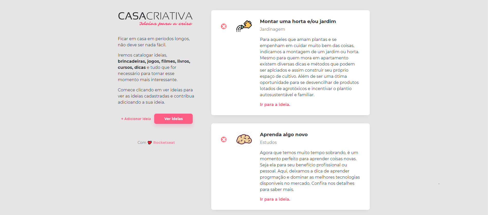
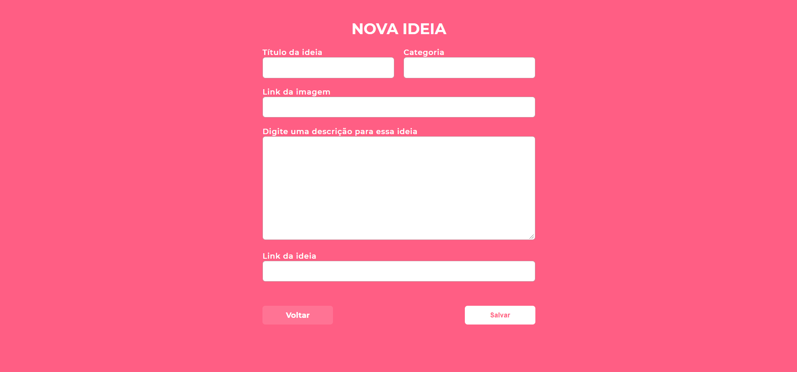
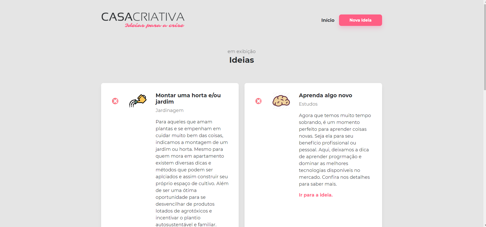
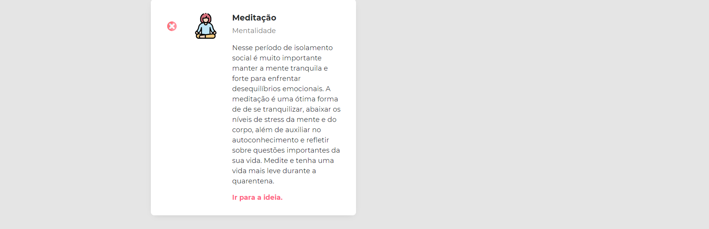

<h1 align="center">
  
</h1>

<h2 align="center">
 Workshop - Semana Omnistack 11.0 
   
</h2>

  <a href="#--projeto">Projeto</a>&nbsp;&nbsp;&nbsp;|&nbsp;&nbsp;&nbsp;
  <a href="#rocket-tecnologias-usadas">Tecnologias</a>&nbsp;&nbsp;&nbsp;|&nbsp;&nbsp;&nbsp;
  <a href="#-layouts">Layout</a>&nbsp;&nbsp;&nbsp;|&nbsp;&nbsp;&nbsp;
  <a href="#-rodando-a-aplicação">Utilizando a aplicação</a>&nbsp;&nbsp;&nbsp;|&nbsp;&nbsp;&nbsp;
  <a href="#como-contribuir">Como contribuir</a>&nbsp;&nbsp;&nbsp;|&nbsp;&nbsp;&nbsp;
  <a href="#memo-licença">Licença</a>

 

 #   Projeto   
 

O <strong>Casa Criativa</strong> é um projeto desenvolvido com Node.js, HTML5, CSS3 e JavaScript, que visa disponibilizar um sistema de catálogo de ideias para se fazer durante o período de quarentena causado pelo novo coronavírus.

A aplicação foi desenvolvida durante o Workshop na Semana Omnistack 11.0 promovida pela Rocketseat. O projeto abordou os conceitos básicos das tecnologias de desenvolvimento web.

 # :rocket: Tecnologias usadas 
Principais tecnologias utilizadas para o desenvolvimento back-end, front-end e banco de dados.

- [HTML5](https://developer.mozilla.org/pt-BR/docs/Web/HTML/HTML5)
- [CSS3](https://css-tricks.com/)
- [Node.js](https://nodejs.org/en/)
- [Express](https://expressjs.com/pt-br/)
- [Nodemon](https://nodemon.io/)
- [SQLite3](https://www.sqlite.org/index.html)
 
#  Layouts
<h2>

  Página inicial 
</h2>

<h2>

 Formulário para adicionar novas ideias  
</h2>

<h2> 
   
  Página de ideias
</h2>

#  Rodando a aplicação 

#### Back-end
1 - `npm install` para baixar todas as dependências necessárias.

2 - `npm start` para rodar o servidor.

#### Front-end Web
1 - `npm install` para baixar todas as dependências necessárias.

2 - `npm start` para rodar o servidor.

# Como contribuir 

- Faça um fork desse repositório;
- Cria uma branch com a sua feature: `git checkout -b minha-feature`;
- Faça commit das suas alterações: `git commit -m 'feat: Minha nova feature'`;
- Faça push para a sua branch: `git push origin minha-feature`.

Depois que o merge da sua pull request for feito, você pode deletar a sua branch.

# :memo: Licença 

Esse projeto está sob a licença ISC.

---

Feito com ❤️ by **Rocketseat**
